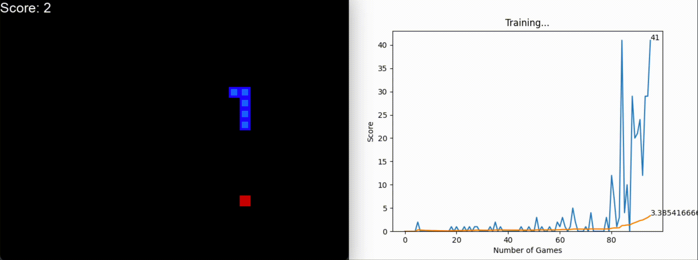

# Snake AI

---
## Description

This program implements a game of Snake and allows either a user or an AI to play. 
The AI is trained using a Q-learning (reinforcement learning) deep neural network.

---
## Setup
- Enter the project directory
- Create a virtual environment (one method is shown below–feel free to use others)

`python3 -m venv snake-env`

- Activate the virtual environment

`source snake-env/bin/activate`

- Download the required libraries and modules by entering the project directory and running:

`pip3 install -r requirements.txt`

- Train/Run the AI

`python3 agent/agent.py`

- Training is automatically cached and resumed from the last run
- To delete the cache, delete the file "model.pth" in the "model" directory

---
- To play Snake as a user

`python3 game/user_game.py`

---

## Example Output

At the start of training (sped up):

After ~100 games of training:

**Findings:**

- Improvements continue until ~120-150 training games. 
- At this point, the AI can reliably achieve scores of 40-60. 
- However, the AI continues to struggle with trapping itself within its tail as its length increases.
- This could potentially be improved by:
  - modifying the state array to include more information about the relative location of the snake's
  body with respect to its head
  - modifying the rewards function 
  - adding manual logic which prefers moves which do not enclose the snake within itself.
